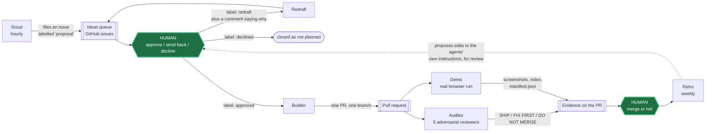
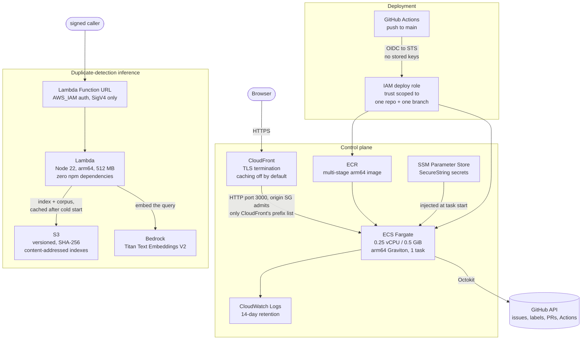

# Loop Dashboard

A control plane for a loop of autonomous Claude coding agents that propose, build, review, and demonstrate changes to real GitHub repositories — with a human approval gate in the middle.

Coding agents are cheap enough now that one can file a well-argued proposal every hour, around the clock. The bottleneck stops being *generating* work and becomes *triaging* it: a queue of plausible-looking issues, each of which takes a human ten minutes to evaluate, arriving faster than any human can read them. This project is the answer to that — a decision layer that turns a stream of agent output into a small number of high-quality decisions. Nine agents run as GitHub Actions workflows in the target repository; the dashboard is where a person approves, rejects, or sends work back, and where the evidence for each decision is assembled before they look at it.

It is a personal tool first. It runs against the author's own repos, on the author's own AWS account, for about $11.50 a month.

---

## Live demo

**https://d1ougmzejkasx3.cloudfront.net** — no login required.

Running on ECS Fargate behind CloudFront. Click through the Process Map, the Ideas queue, and the Metrics page.

**The data you see is an invented snapshot, and the page says so.** This is a single-owner tool pointed at private repositories, so the demo cannot show the real backlog. What is real is the application, the AWS infrastructure serving it, and the access-control mechanism deciding what you are allowed to do.

That mechanism is worth a look, because "read-only demo" is easy to get subtly wrong. `proxy.ts` and `lib/public-access.ts` answer anonymous page loads and API *reads* from a frozen fixture set in `lib/demo/` — the proxy serves those itself, so for a signed-out visitor **no route handler ever executes**, which means no GitHub token is ever in scope and no write path can be reached even in principle. Everything else is a flat 403:

```console
$ curl -o /dev/null -w '%{http_code}\n' https://d1ougmzejkasx3.cloudfront.net/ideas
200

$ curl -o /dev/null -w '%{http_code}\n' -X POST \
    -d '{"action":"approve"}' https://d1ougmzejkasx3.cloudfront.net/api/ideas/1
403
```

`tests/lib/public-access.test.ts` pins the exact set of anonymously reachable endpoints, so widening that surface has to show up as a deliberate diff in a pull request rather than as a quiet side effect. Responses carry HSTS, `X-Content-Type-Options`, `X-Frame-Options: DENY`, `Referrer-Policy`, and a per-request nonce-based CSP with `strict-dynamic`.

One more piece of honesty about that deployment: **no `GITHUB_TOKEN` is provisioned in the cloud task at all.** The only token that currently exists is the GitHub CLI's own broad OAuth token, which should never leave a laptop, and a properly scoped fine-grained PAT has not been minted for it yet. So the AWS deployment today is a healthy, correctly-secured container serving fixtures — the live loop runs locally. That is a real gap, and it is listed as one in [`docs/ARCHITECTURE.md`](docs/ARCHITECTURE.md) rather than papered over.

Three alternative design directions for the UI are rendered as static pages in [`docs/mockups/`](docs/mockups/).

---

## The loop



The human sits in exactly two places, and nothing crosses either without them: **nothing gets built until a person approves the idea**, and **nothing gets merged until a person merges it**. Every agent action either produces something for a human to judge or acts on a judgement a human already made.

The nine agents:

| Agent | Trigger | What it does |
|---|---|---|
| **Scout** | hourly | Researches the market and the codebase, files new ideas as issues labelled `proposal`. Never writes code. Stops filing when the open queue hits a configurable cap. |
| **Redraft** | `redraft` label | Rewrites an idea to match the feedback comment and puts it back in the queue. |
| **Builder** | `approved` label, 30-min backstop | Picks the strongest idea and opens exactly one PR from a `claude/` branch. |
| **Auditor** | every PR | Spawns five adversarial reviewers, posts one verdict comment. |
| **Demo** | `claude/` PRs | Boots the app, drives it in headless Chromium, uploads screenshots and video. |
| **Retro** | weekly | Reviews what got approved, ignored, or merged; proposes edits to the loop's own instructions. |
| **Metrics** | daily, every PR | Plain reporting job, no AI. Writes the numbers up. |
| **@mention** | `@claude` in any comment | Wakes an agent from the GitHub phone app. The remote control. |
| **Tool installer** | dashboard event | Wires a newly requested tool or skill into the right workflow. |

Two details worth knowing, because the obvious guess about each is wrong:

**The Auditor's five reviewers are role-specialised, not five copies of the same prompt.** They are Correctness ("trace the logic, find the bug"), Regression ("what breaks — check every caller and import"), Security ("secrets, injection, authz, unsafe deps, exposed endpoints"), Tests ("name the failing case this PR misses"), and Simplicity ("dead code, duplication, over-engineering"). They run as blocking subagents in one message; the parent verifies each finding itself before posting a single SHIP / FIX FIRST / DO NOT MERGE verdict. This is where tokens are deliberately spent.

**Retro proposes, it does not rewrite.** It cannot edit `.github/workflows/` — the Actions `GITHUB_TOKEN` has no `workflow` scope, so GitHub rejects the push outright, and those files are copies of a shared template that would be overwritten anyway. So Retro opens one issue summarising the week and, only when there is a genuinely repeated lesson, one PR appending dated lines to `LEARNINGS.md` and a structured suggestion (workflow file, exact current wording, proposed diff, rationale) to `docs/loop-suggestions.md`. A human applies it through the dashboard's template editor. The system proposes changes to its own instructions; it does not make them.

---

## How it works

The split is the whole design. **The dashboard is the decision layer. GitHub Actions is the execution layer.** They share no runtime and no database.

The nine workflows live in the *target* repository's `.github/workflows/`, maintained here as an editable template under `config/loop-template/workflows/`. They run on GitHub's runners with GitHub's own credentials. The dashboard never executes agent work; it reads state, presents decisions, and writes labels.

### There is no database

State lives in GitHub issues, labels, and pull requests. There is no Postgres, no SQLite, no Redis, no DynamoDB — `grep` the dependency tree and you will not find a database client.

Four labels are the state machine: `proposal` → `approved` | `redraft` | `declined`. Approving an idea is one API call that *replaces* the issue's queue label rather than adding and removing in two steps, which avoids a window where the dashboard and the Builder read different states. That label write is itself the trigger: `claude-builder.yml` listens on `issues: labeled`. A `workflow_dispatch` call is made only in the one case where GitHub would not fire an event anyway — re-applying a label the issue already has.

This is a deliberate trade, and the cost is recorded next to it: no transactions, no concurrent-write safety, no querying, and GitHub's API rate limits. The data is small, naturally versioned, human-readable, and already lives where the work happens. Git gives history and rollback for free. The choice stops working the moment there are multiple users — which is exactly why multi-tenancy is deferred rather than half-built.

Decisions like this one are logged in [`docs/design-decisions.md`](docs/design-decisions.md) — what was decided, why, what was rejected, and what the accepted tradeoff was. It is the fastest way to tell whether the choices in this repo were reasoned or accidental.

---

## The AWS architecture



Everything is `us-east-1`. The pieces, and why each is the way it is:

**ECS Fargate on arm64 Graviton, 0.25 vCPU / 0.5 GiB, one task.** Fargate over Amplify (caps at Next.js 15; this is Next.js 16) and over App Runner (closing to new customers in April 2026). arm64 because building `linux/amd64` on Apple Silicon segfaults — Next.js 16 with Turbopack dies under QEMU with `uncaught target signal 11` — and Graviton is cheaper anyway. The task count is pinned at 1 *on purpose*, and the reason is written into `infra/deploy.sh`: six module-level in-memory job stores assume a single process, so background-job polling would 404 intermittently behind two tasks. That is a real scaling limit, honestly labelled, and it is fixed by moving that state out of process memory — not by raising a number.

**CloudFront, and no load balancer.** An ALB would add ~$16.50/month on its own, which is most of the bill for a single-owner tool. Instead CloudFront terminates TLS and the task's security group admits only CloudFront's origin-facing managed prefix list, so the public IP is not directly reachable. The trade is stated rather than hidden: the CloudFront-to-origin hop is plain HTTP, and closing it needs an ALB plus an ACM certificate. CloudFront here is a TLS front door more than a CDN — the default behaviour uses `CachingDisabled`, because responses depend on a session cookie and caching them at the edge would serve one visitor's page to another; only `/_next/static/*` gets `CachingOptimized`, since those filenames are content-hashed and genuinely immutable. The origin request policy is pinned to `Managed-AllViewerAndCloudFrontHeaders-2022-06` because it is the only one that forwards `CloudFront-Forwarded-Proto`, which is the only signal the app has that the viewer was on TLS — and therefore the only thing that puts the `Secure` flag on the session cookie.

**Secrets in SSM Parameter Store as SecureStrings**, injected through the task definition's `secrets` block, never `environment` — a value in `environment` is readable by anyone who can call `ecs:DescribeTaskDefinition`.

**Deployment by GitHub OIDC federation.** No AWS access keys exist as repository secrets. Each run assumes a role via short-lived STS credentials, and the trust policy names exactly one subject: `repo:<owner>/loop-dashboard:ref:refs/heads/main`. A pull request, a fork, or any other branch cannot assume it. Permissions are resource-scoped — ECR pushes to one repository, `ecs:UpdateService` to one service ARN, `iam:PassRole` limited to the two ECS roles and further conditioned on `iam:PassedToService=ecs-tasks.amazonaws.com`. The workflow builds on `ubuntu-24.04-arm`, pushes, registers a task definition, waits for the service to stabilise, repoints the CloudFront origin at the new task, and then polls `/api/health` through CloudFront for up to five minutes as a post-deploy gate.

**Lambda for inference.** `nodejs22.x`, arm64, 512 MB, 15s timeout, **zero npm dependencies** — the handler signs its own SigV4 requests. Its Function URL is `AWS_IAM`-authed, so an unsigned request gets a 403. Its execution role carries no managed policies at all, not even `AWSLambdaBasicExecutionRole`: one inline policy grants `bedrock:InvokeModel` on a single model ARN, `s3:GetObject` on two prefixes, and logs to its own log group only. Warm invocations return in 146–275 ms; cold start is about 1.1 s.

**S3 for versioned ML artifacts.** Bucket versioning on, all four public-access-block settings on. Each build writes a content-addressed `<sha256>.json` copy *first*, then moves the `latest.json` pointer — so `latest.json` can never point at a build whose archive copy failed to land. An upload failure is fatal rather than a warning, because a build that reports success while `latest.json` still points at last week's index is how a stale artifact gets evaluated for a month without anyone noticing.

### Cost

**~$11.50/month**, itemised in `infra/deploy.sh`: ~$7.20 Fargate (0.25 vCPU / 0.5 GiB Graviton, 730 hours) + $3.65 for the public IPv4 address + well under $1 of ECR storage and CloudWatch Logs. CloudFront stays inside the perpetual free tier at this traffic level. S3 storage for the ML artifacts — 4.1 MB across 7 objects — is about $0.0001/month.

### What is not built

No ALB, no WAF, no custom domain or ACM certificate, no VPC private subnets, no RDS, no Cognito, no EventBridge, and **no CloudWatch alarms**. Those appear in the planning document, not in the account. There is no auto-scaling, no multi-region, and no uptime measurement, because there is one task in one region and nothing is measuring it.

One honest gap: **human access to the AWS account still runs through the root identity** rather than a scoped IAM role with short-lived credentials. The CI path is federated and clean; the human path is not yet, and it is the weakest thing in the setup.

A note on Bedrock, because the failure mode here is worth knowing. Both halves of the Bedrock integration are verified live: Amazon Titan Text Embeddings V2 built the embedding index, and Anthropic Claude answers real requests — Sonnet 4.5, Haiku 4.5 and Opus 4.5 all invoke successfully. But current Claude models on Bedrock are **inference-profile only**, so the model ID must carry a `us.` (or `global.`) prefix. Passing the bare `anthropic.claude-sonnet-4-5-…` ID fails with a `ValidationException` telling you on-demand throughput is not supported for it, and going through the wrong endpoint surfaces the same situation as a `permission_error` or a 404 — all three read like "you do not have access" when the entitlement is in fact granted and the request shape is simply wrong. That misdiagnosis cost real time here, which is why it is written down. The local default remains the Claude CLI, so day-to-day runs cost nothing.

---

## The ML

**The problem is real and it was measured, not assumed.** The Scout files near-duplicate proposals — 19 near-duplicate pairs were counted by hand in the live backlog. A duplicate that reaches the queue costs a human the ten minutes it takes to work out they have read it before. The question worth answering is not "can embeddings do this" but "does a dense model actually beat the keyword scorer already shipping in this repo, by enough to justify the dependency?"

**The corpus** is 132 documents — 62 issues and 70 PRs from the live target repo — giving 8,646 pairs. Extraction is deterministic: re-running on unchanged data produces a byte-identical file, verified by hash.

**Five methods, wired identically and scored from the same pair list** so nothing is handicapped by how it was plumbed in:

- `overlap` — the scorer already in `lib/tool-fit.ts`, reimplemented verbatim (same tokenizer, same 30-word stoplist) rather than imported, because the original is typed against a different domain object.
- `overlap_norm` — the same count divided by the smaller document's vocabulary. Included because a raw count grows with document length, which makes a single threshold meaningless across pairs. Reporting both is the fair treatment.
- `bm25` — Okapi BM25 written from scratch, ~70 lines, no dependency. k1 = 1.5, b = 0.75. Asymmetric by construction, so the pair score is the mean of both directions.
- `dense_local` — cosine similarity over `all-MiniLM-L6-v2`, 384 dims, running locally via transformers.js. Free, offline, ~27 ms/doc warm.
- `dense_titan` — cosine similarity over Amazon Titan Text Embeddings V2 on Bedrock, 1024 dims. Full Matryoshka width on purpose, so "which model" stays the only axis of variation instead of adding "which truncation" as a second one. 132 documents embedded in 9.8 s.

**Sampling.** A uniform random 150 of 8,646 pairs would contain approximately zero positives and every method would score ~100%. So the sample is stratified over five strata, including a `dense_only` stratum — the top 30 by cosine among pairs *outside* the lexical top 400. That stratum exists so the labelled set can contain duplicates the lexical baseline never surfaces; without it, "dense finds things BM25 misses" would be unfalsifiable, because no such pair would ever have been labelled. Every row carries its `stratum_size`, `stratum_sampled` and `inclusion_prob`, and the harness reports a Horvitz–Thompson inverse-inclusion-probability weighted estimate as the only figure that speaks about the corpus rather than the sample.

### Results

Positive class = `duplicate` (25 of 150 pairs). Average precision, with 95% percentile intervals from 1,000 bootstrap resamples:

| Method | Average precision | 95% CI | ROC AUC |
|---|---|---|---|
| `overlap` | 0.622 | [0.410, 0.791] | 0.856 |
| `bm25` | 0.760 | [0.592, 0.898] | 0.955 |
| `overlap_norm` | 0.807 | [0.644, 0.922] | 0.954 |
| **`dense_local`** (MiniLM, 384d) | **0.937** | [0.844, 0.991] | 0.985 |
| **`dense_titan`** (Titan V2, 1024d) | **0.934** | [0.856, 0.987] | 0.982 |

**The finding is that there is no finding between the two encoders, and that is the point.** MiniLM's interval is [0.844, 0.991]; Titan's is [0.856, 0.987]. They overlap almost entirely. At n = 150 this dataset cannot tell them apart, and the honest conclusion is not "MiniLM wins" but "these are indistinguishable, so keep the free local one." Flipping the positive class to `duplicate` ∪ `related` reverses the point estimates (Titan 0.981, MiniLM 0.974) with intervals that overlap just as heavily — which is exactly what you would expect if the difference is noise, and is a good reason to distrust anyone quoting a point estimate without one.

The shippable threshold comes from the precision-first operating point, not from best-F1, because a false "duplicate" that suppresses a good proposal costs more than a miss: at cosine ≥ 0.828, MiniLM reaches precision 0.95 at recall 0.76. The best-F1 threshold is reported too, and carries a `caveat` field in the output saying it was chosen on the same data it is scored on.

### The confound, stated plainly

**The 150 labels were assigned by an LLM (Claude Opus, three independent batches, retrieval scores withheld from the labeller), not by a human.** Only 10 pairs have ever been hand-labelled, and they are all one class, so they cannot validate anything.

This matters unevenly, and the distinction is the interesting part:

- **The dense-vs-lexical comparison is confounded.** The labeller judged semantic equivalence; dense encoders model semantic equivalence. The dense methods are being scored against a criterion generated by a system that shares their inductive bias. The ~0.15 AP gap over BM25 should not be reported as "embeddings beat keyword search" without that caveat attached.
- **The Titan-vs-MiniLM comparison is not confounded.** Whatever bias the labeller has, it applies identically to both encoders. That comparison survives, which is precisely why it is the one that gets quoted.

Knowing which of your results a known bias destroys and which it leaves standing is worth more than the results.

### Two data-quality findings that killed a different model

Before the dedup work, the plan was a proposal-acceptance classifier — predict which ideas get merged. Measuring the data first killed it, twice over. These findings are from that analysis, not the dedup evaluation:

1. **Author leak.** All 24 human-authored PRs were merged (100%); all 26 rejections were bot PRs. A merge-prediction model trained on all 70 would learn "was a human involved" and report a false ~0.95 AUC. It would have looked like a great result.
2. **Temporal confound.** The queue stalled on 2026-07-28 and stayed stalled. "Not merged" therefore mostly means "filed after triage stopped," not "bad idea." The target variable was measuring the calendar, not quality.

A third blocker: the `declined` and `redraft` labels had never been used — zero issues each. Every "no" in the system was silence rather than a recorded judgement, so there were no negative labels to learn from at all.

The model was never built. Finding this by measurement, before spending a week on it, is the outcome.

### Deployed inference

The duplicate detector runs as a Lambda behind an IAM-authed Function URL: it embeds the query text through Bedrock, scores it against the S3-hosted index cached in module scope after cold start, and returns ranked matches with a duplicate flag at the swept threshold of 0.842. On a live call, novel text matched two real issues at 0.858 and 0.856 while an unrelated control scored 0.31. It is a standalone endpoint — the dashboard UI does not call it yet.

---

## Engineering notes worth reading

If you want to sample the work rather than read the whole repo, these are the files that show the most:

- **[`docs/ARCHITECTURE.md`](docs/ARCHITECTURE.md)** — the long version of everything above, audited against the live AWS account rather than against the repo, with a section listing what is unfinished, what is wired but unused, and where the documentation had drifted from the code. Start here if you want depth.
- **[`docs/evidence/langgraph-run-2026-09-02.md`](docs/evidence/langgraph-run-2026-09-02.md)** — a LangGraph human-in-the-loop triage agent, and the receipt proving it actually halts. A previous session had claimed the agent was "verified live" and left behind only source code and passing unit tests; unit tests with injected fakes prove the wiring, not that the graph ever stopped on a real backlog. So the run was done again for real: four live runs against eight open issues in the target repo, every one a dry run with `--apply` never passed and zero writes reaching GitHub. The four-node graph halts at a checkpointed `interrupt()` with `getState()` reporting `next: ["apply_decisions"]`, and resumes from the checkpoint with human input. In the second run, human input changed 8 of 8 actions — the interrupt is load-bearing, not decorative.
- **[`docs/design-decisions.md`](docs/design-decisions.md)** — eleven architecture decisions with the rejected alternative and the accepted cost for each. Hosting, deployment auth, storage, hand-rolled sessions, why the ML stayed in TypeScript instead of standing up SageMaker for a 44-row problem.
- **[`docs/ml-dedup.md`](docs/ml-dedup.md)** — the full evaluation methodology: stratified sampling with retained inclusion probabilities, why the harness refuses to run on an incomplete label file, why ties are never split in the PR curve, and why a synthetic-label smoke test scoring *well* would indicate a bug rather than a result.
- **[`docs/ml-artifacts-s3.md`](docs/ml-artifacts-s3.md)** — content-addressed artifact storage, and why the S3 loader falls back to a local copy while the Bedrock encoder deliberately refuses to fall back to MiniLM. One is a transport detail; the other would silently mislabel which model produced a number and corrupt an evaluation.
- **Security fixes.** Three defects found and closed, with the reasoning in the commits and in decision #11: an authentication bypass on API routes ending in an image extension (`aac0fc6`), two LLM chat routes handing an unbounded filesystem to the model (`a57b95b`), and an authorization gate inverted into an amplifier (`e470f55`) — the mention workflow gated on the *comment author's* repository permission, which is sound when a person comments and useless when the dashboard does, because the dashboard's own token is an admin. The write-up names the stronger fix that was deliberately *not* applied and why.
- **Tests.** 146 Vitest tests across the auth crypto, the public-access gate, the AI response parsing, the relay sanitiser, the LangGraph graph, and the embedding backends — deliberately targeted at the security and parsing code rather than chasing coverage across 35,000 lines. A broken signature check is a security hole and a broken JSON parser silently corrupts every AI feature; both are pure functions with no network calls, so they are cheap to test. They exist to prove the security claims this project makes about itself rather than merely asserting them.

---

## Running it locally

Requires Node 22+ and npm. Nothing else — no database, no Docker, no AWS account.

```bash
git clone https://github.com/ApagPlayz/loop-dashboard.git
cd loop-dashboard
npm install
cp .env.example .env.local
```

Open `.env.local` and set two values:

- `DASHBOARD_PASSWORD` — anything long and random. Without it the server still boots and serves `/login`, but submitting a password returns a 500.
- `GITHUB_TOKEN` — a fine-grained PAT. Not required to log in, but every page reads live GitHub data, so the dashboard is empty without one. `.env.example` lists the exact repository permissions, including the two that are easy to miss and fail confusingly when absent.

Then:

```bash
npm run dev          # http://localhost:3000
npm test             # 146 tests, no credentials needed — all AWS and fs calls are mocked
npm run build        # standalone production build
```

Mac-only launcher features are off unless you set `LOOP_DASHBOARD_LOCAL_MODE=1`, so a cloud deployment cannot expose them by accident.

### The ML pipeline

Only the first step and the optional Bedrock variant need credentials; everything else runs offline.

```bash
node scripts/ml/extract-corpus.mjs                        # needs an authenticated gh CLI
node scripts/ml/build-index.mjs                           # MiniLM, local, no AWS — downloads the model once
EMBEDDING_BACKEND=bedrock node scripts/ml/build-index.mjs  # Titan V2 — needs AWS creds + Bedrock model access
node scripts/ml/generate-pairs.mjs                        # stratified sample of pairs to label
node scripts/ml/label.mjs                                 # interactive, resumable, one keypress per pair
node scripts/ml/evaluate.mjs                              # -> metrics/dedup-eval.json
node scripts/ml/compare-encoders.mjs                      # readable comparison table
```

With no labelled file, `evaluate.mjs` fabricates labels from a seeded RNG, prints a banner, and stamps `"labels": "synthetic-smoke-test"` into the output — so every code path is proven to run before anyone spends an hour labelling. The correct outcome there is chance.

### The LangGraph triage agent

```bash
node scripts/triage-cli.mjs --repo=owner/name --limit=8   # dry run by default; --apply to write
node scripts/triage-interrupt-proof.mjs --limit=8         # prints getState() and the raw __interrupt__
```

### Container

```bash
docker build -t loop-dashboard .
docker run -p 3000:3000 -e DASHBOARD_PASSWORD=... -e SESSION_SECRET=... loop-dashboard
```

Multi-stage `deps → builder → runner` on `node:22-alpine`, shipping only the pruned `.next/standalone` output and running as a non-root user. No secrets at build time; everything is read from `process.env` at request time.

---

## Tech stack

**Application** — TypeScript, Next.js 16 (App Router), React 19, Tailwind CSS v4, Octokit. ~35,000 lines across 68 API routes. Note that in Next.js 16 the request interceptor is `proxy.ts`, not `middleware.ts`.

**AI / ML** — Anthropic Claude via three interchangeable backends (local CLI, Anthropic API, Bedrock) behind one call interface; LangGraph.js for the human-in-the-loop triage graph; transformers.js with `all-MiniLM-L6-v2` for local embeddings; Amazon Bedrock Titan Text Embeddings V2 for the hosted comparison.

**AWS** — ECS Fargate, ECR, CloudFront, Lambda, S3, Bedrock, SSM Parameter Store, IAM (including GitHub OIDC federation), CloudWatch Logs.

**Infrastructure & tooling** — Docker (multi-stage, arm64), GitHub Actions, Vitest, ESLint, `gh` CLI, Playwright.

---

## A note on what this repo claims

Every number here traces to a file or a command you can run. Where something is measured, the interval is reported next to it. Where something is confounded, the confound is named and its scope stated. Where something is planned but not built — alarms, a load balancer, multi-tenancy — it is listed as not built.

The unglamorous findings are in here on purpose: an evaluation that could not separate two models, a model that was never built because the data had a leak in it, a task count pinned to one by in-memory state. They are the parts most likely to be true.
