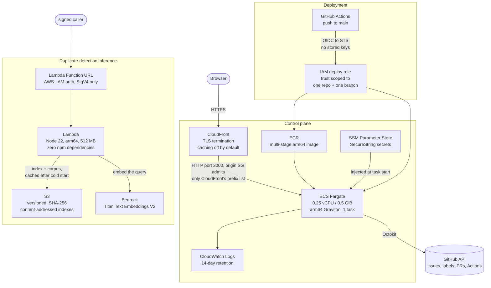

# The AWS architecture

> Extracted from the README so the front page stays short. Everything below was
> checked against the live account rather than against the plan documents; see
> `docs/ARCHITECTURE.md` for the audit that did the checking.

Everything is `us-east-1`. The pieces, and why each is the way it is:

**ECS Fargate on arm64 Graviton, 0.25 vCPU / 0.5 GiB, one task.** Fargate over Amplify (caps at Next.js 15; this is Next.js 16) and over App Runner (closing to new customers in April 2026). arm64 because building `linux/amd64` on Apple Silicon segfaults — Next.js 16 with Turbopack dies under QEMU with `uncaught target signal 11` — and Graviton is cheaper anyway. The task count is pinned at 1 *on purpose*, and the reason is written into `infra/deploy.sh`: six module-level in-memory job stores assume a single process, so background-job polling would 404 intermittently behind two tasks. That is a real scaling limit, honestly labelled, and it is fixed by moving that state out of process memory — not by raising a number.

**CloudFront, and no load balancer.** An ALB would add ~$16.50/month on its own, which is most of the bill for a single-owner tool. Instead CloudFront terminates TLS and the task's security group admits only CloudFront's origin-facing managed prefix list, so the public IP is not directly reachable. The trade is stated rather than hidden: the CloudFront-to-origin hop is plain HTTP, and closing it needs an ALB plus an ACM certificate. CloudFront here is a TLS front door more than a CDN — the default behaviour uses `CachingDisabled`, because responses depend on a session cookie and caching them at the edge would serve one visitor's page to another; only `/_next/static/*` gets `CachingOptimized`, since those filenames are content-hashed and genuinely immutable. The origin request policy is pinned to `Managed-AllViewerAndCloudFrontHeaders-2022-06` because it is the only one that forwards `CloudFront-Forwarded-Proto`, which is the only signal the app has that the viewer was on TLS — and therefore the only thing that puts the `Secure` flag on the session cookie.

**Secrets in SSM Parameter Store as SecureStrings**, injected through the task definition's `secrets` block, never `environment` — a value in `environment` is readable by anyone who can call `ecs:DescribeTaskDefinition`.

**Deployment by GitHub OIDC federation.** No AWS access keys exist as repository secrets. Each run assumes a role via short-lived STS credentials, and the trust policy names exactly one subject: `repo:<owner>/loop-dashboard:ref:refs/heads/main`. A pull request, a fork, or any other branch cannot assume it. Permissions are resource-scoped — ECR pushes to one repository, `ecs:UpdateService` to one service ARN, `iam:PassRole` limited to the two ECS roles and further conditioned on `iam:PassedToService=ecs-tasks.amazonaws.com`. The workflow builds on `ubuntu-24.04-arm`, pushes, registers a task definition, waits for the service to stabilise, repoints the CloudFront origin at the new task, and then polls `/api/health` through CloudFront for up to five minutes as a post-deploy gate.

**Lambda for inference.** `nodejs22.x`, arm64, 512 MB, 15s timeout, **zero npm dependencies** — the handler signs its own SigV4 requests. Its Function URL is `AWS_IAM`-authed, so an unsigned request gets a 403. Its execution role carries no managed policies at all, not even `AWSLambdaBasicExecutionRole`: one inline policy grants `bedrock:InvokeModel` on a single model ARN, `s3:GetObject` on two prefixes, and logs to its own log group only. Warm invocations return in 146–275 ms; cold start is about 1.1 s.

**S3 for versioned ML artifacts.** Bucket versioning on, all four public-access-block settings on. Each build writes a content-addressed `<sha256>.json` copy *first*, then moves the `latest.json` pointer — so `latest.json` can never point at a build whose archive copy failed to land. An upload failure is fatal rather than a warning, because a build that reports success while `latest.json` still points at last week's index is how a stale artifact gets evaluated for a month without anyone noticing.

### Cost

**~$11.50/month**, itemised in `infra/deploy.sh`: ~$7.20 Fargate (0.25 vCPU / 0.5 GiB Graviton, 730 hours) + $3.65 for the public IPv4 address + well under $1 of ECR storage and CloudWatch Logs. CloudFront stays inside the perpetual free tier at this traffic level. S3 storage for the ML artifacts — 4.1 MB across 7 objects — is about $0.0001/month.

### What is not built

No ALB, no WAF, no custom domain or ACM certificate, no VPC private subnets, no RDS, no Cognito, no EventBridge, and **no CloudWatch alarms**. Those appear in the planning document, not in the account. There is no auto-scaling, no multi-region, and no uptime measurement, because there is one task in one region and nothing is measuring it.

One honest gap: the **machine** path into this account is federated and clean — GitHub OIDC, short-lived STS credentials, no stored keys — but interactive human access has not been given the same treatment yet. That asymmetry is the weakest thing in the setup and it is on the list, not papered over.

A note on Bedrock, because the failure mode here is worth knowing. Both halves of the Bedrock integration are verified live: Amazon Titan Text Embeddings V2 built the embedding index, and Anthropic Claude answers real requests — Sonnet 4.5, Haiku 4.5 and Opus 4.5 all invoke successfully. But current Claude models on Bedrock are **inference-profile only**, so the model ID must carry a `us.` (or `global.`) prefix. Passing the bare `anthropic.claude-sonnet-4-5-…` ID fails with a `ValidationException` telling you on-demand throughput is not supported for it, and going through the wrong endpoint surfaces the same situation as a `permission_error` or a 404 — all three read like "you do not have access" when the entitlement is in fact granted and the request shape is simply wrong. That misdiagnosis cost real time here, which is why it is written down. The local default remains the Claude CLI, so day-to-day runs cost nothing.
